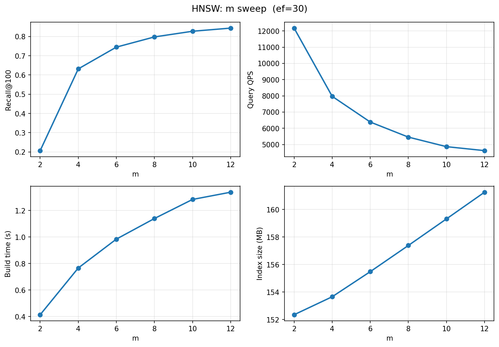
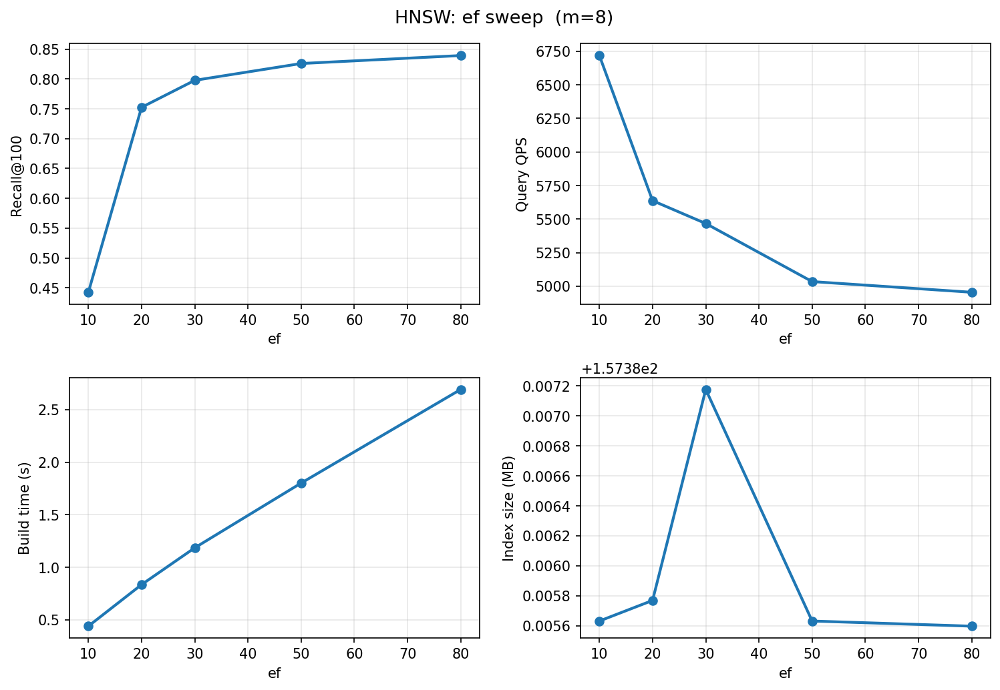
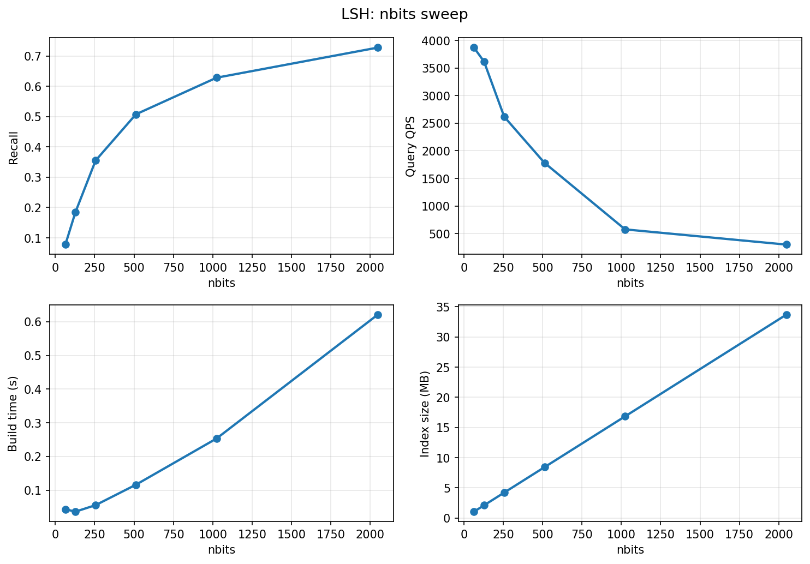
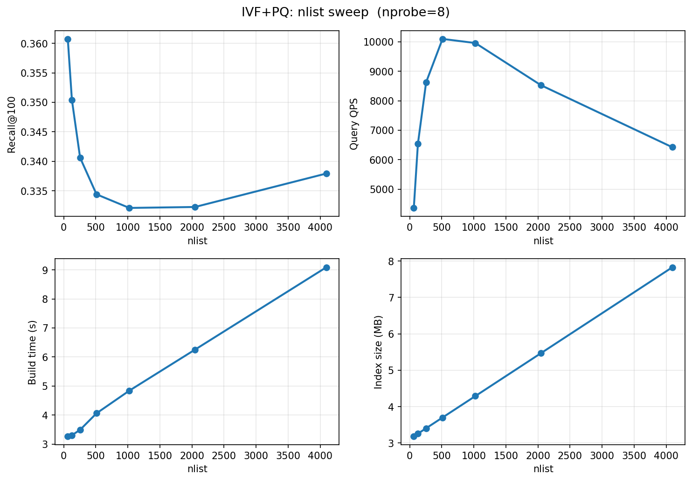
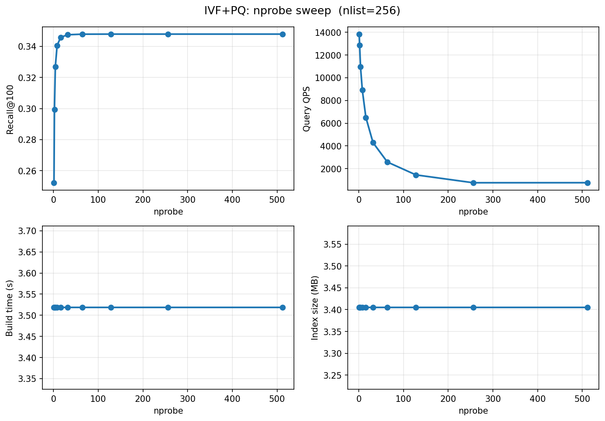
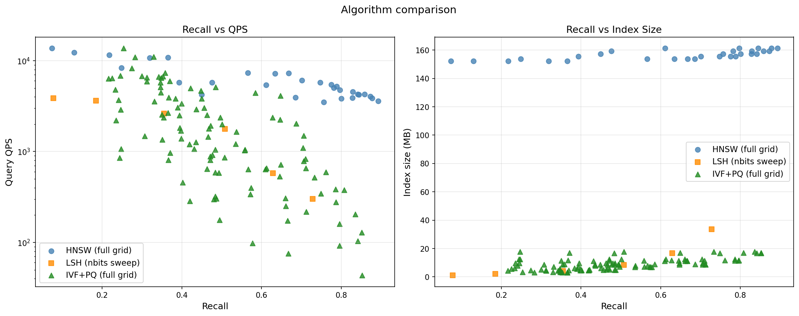

# Отчёт по алгоритмам приближённого поиска ближайших соседей (ANN)

Студент: Русинов Дмитрий

Содержание:

- [Задание](#задание)
- [Датасет](#датасет)
- [Алгоритмы](#алгоритмы)
  - [HNSW](#hnsw)
  - [LSH](#lsh)
  - [IVF+PQ](#ivfpq)
- [Результаты](#результаты)
  - [HNSW: влияние m](#hnsw-влияние-параметра-m-ef30)
  - [HNSW: влияние ef](#hnsw-влияние-параметра-ef-m8)
  - [LSH: влияние nbits](#lsh-влияние-параметра-nbits)
  - [IVF+PQ: влияние nlist](#ivfpq-влияние-параметра-nlist-nprobe8)
  - [IVF+PQ: влияние nprobe](#ivfpq-влияние-параметра-nprobe-nlist256)
  - [Сравнение алгоритмов](#сравнение-алгоритмов)
- [Вывод](#вывод)

---

## Задание

Сравнить алгоритмы приближённого поиска ближайших соседей (Approximate Nearest Neighbor, ANN) на реальных векторных данных. Для каждого алгоритма проверить несколько конфигураций параметров и оценить компромисс между точностью (Recall100), скоростью запроса (QPS) и размером индекса.

---

## Датасет

Использовалась предобученная модель **word2vec-ruscorpora-300** из библиотеки `gensim` - векторные представления слов русского языка, обученные на корпусе RNC (Национальный корпус русского языка). Каждое слово представлено вектором размерностью **300**.

Для чистоты эксперимента датасет был отфильтрован: оставлены только существительные (слова с тегом `_NOUN`). Итоговый корпус составил **128 414 слов**.

Из корпуса было выбрано 10 000 запросных слов, а все алгоритмы индексировали **полный корпус** (128 414 векторов). Для каждого запросного слова была вычислена точная «ground truth» — 100 ближайших соседей методом полного перебора с использованием квадрата евклидова расстояния.

---

## Алгоритмы

### HNSW

**Библиотека:** `hnswlib` (C++)

HNSW (Hierarchical Navigable Small World) — иерархический граф, в котором каждый вектор связан с несколькими ближайшими соседями на нескольких уровнях. Построение индекса происходит инкрементально: каждый новый вектор вставляется в граф, соединяясь с `m` ближайшими на каждом уровне. При поиске алгоритм «спускается» по уровням графа, на каждом шаге двигаясь к ближайшим известным соседям. Используется пространство `l2`, что соответствует квадрату евклидова расстояния.

Ключевые параметры:

| Параметр          | Влияние                                                                                    |
| ----------------- | ------------------------------------------------------------------------------------------ |
| `m`               | Количество рёбер на вершину. Больше - выше точность и размер индекса, медленнее построение |
| `ef_construction` | Размер очереди при построении. Больше - точнее связи, медленнее вставка                    |
| `ef_query`        | Размер очереди при поиске. Больше - выше recall, ниже QPS                                  |

---

### LSH

**Библиотека:** `faiss` (`IndexLSH`)

LSH (Locality Sensitive Hashing) основан на случайных проекциях: для каждого вектора генерируется бинарный хеш через проецирование на случайные гиперплоскости. `faiss.IndexLSH` хранит все векторы в виде компактных бинарных кодов и при поиске находит k ближайших по расстоянию Хэмминга между кодами — полностью векторизованно на уровне C++.

Ключевые параметры:

| Параметр | Влияние                                                                              |
| -------- | ------------------------------------------------------------------------------------ |
| `nbits`  | Длина хеша в битах. Больше - точнее разделение пространства, выше recall и размер индекса |

---

### IVF+PQ

**Библиотека:** `faiss`

IVF+PQ (Inverted File Index + Product Quantization) - двухэтапный алгоритм. На первом этапе векторное пространство разбивается на `nlist` кластеров (IVF). При поиске исследуются только `nprobe` ближайших кластеров, что резко сокращает число сравнений. На втором этапе (PQ) каждый вектор сжимается: пространство делится на `m_pq` подпространств, и каждое кодируется отдельным квантователем. Это значительно уменьшает размер индекса.

Ключевые параметры:

| Параметр | Влияние                                                                                 |
| -------- | --------------------------------------------------------------------------------------- |
| `nlist`  | Число кластеров. Больше - тоньше разбивка, выше точность при том же `nprobe`            |
| `nprobe` | Число проверяемых кластеров. Больше - выше recall, ниже QPS                             |
| `m_pq`   | Число подпространств PQ. Фиксировано на 15 (300 / 15 = 20 измерений на подпространство) |

---

## Результаты

Индекс строился на полном корпусе (128 414 векторов). Время построения и запроса измерялось через `time.perf_counter()`. Размер индекса: для FAISS — через `faiss.serialize_index`, для HNSW — сохранением в временный файл через `hnswlib`.

### HNSW: влияние параметра m (ef=30)

Recall и время билда растут при росте m, причем для recall наблюдается логарифмическая зависимость. QPS падает при росте m но тоже не линейно, а по гиперболе. Index size растет линейно от m.

### HNSW: влияние параметра ef (m=8)

ef не вли яет на размер индекса, однако также позволяет улучшить recall, но ухудшает QPS.

### LSH: влияние параметра nbits

nbits положительно влияет на recall (логарифмическая зависимость), ухудшает QPS нелиейно и линейно увеличивает время построения и размер индекса

### IVF+PQ: влияние параметра nlist (nprobe=8)

прослеживается интересная зависимость: для nlist необходимо подбирать определенные числа, нельзя его просто увеличивать и надеяться на улучшающийся recall. На 1000 прослеживается наилучший QPS и наилучший recall, однако далее они ухудшаются

### IVF+PQ: влияние параметра nprobe (nlist=256)

Recall быстро выходит на плато: с nprobe=1 (0.252) до nprobe=8 (0.341) — скачок на 0.089, но с nprobe=8 до nprobe=64 добавляется лишь 0.007. Потолок ~0.35 обусловлен потерями квантования PQ — часть информации теряется при сжатии необратимо. QPS снижается плавно: 9 290 → 1 811.

### Сравнение алгоритмов

Каждый алгоритм показан своей кривой — слева Recall vs QPS, справа Recall vs размер индекса.

---

## Вывод

Ни один из протестированных алгоритмов не является «лучшим» в абсолютном смысле — выбор определяется приоритетами конкретной задачи.

**HNSW** показывает наилучший recall среди всех алгоритмов (до 0.844 при m=12, ef=30) при очень быстром построении благодаря `hnswlib` (1–3 с). Главный недостаток — большой размер индекса (~155–165 MB на 128k векторах): граф хранит исходные векторы и связи между ними. Это делает HNSW предпочтительным выбором, когда точность важна, а памяти достаточно.

**LSH** (`faiss.IndexLSH`) — лучший выбор при жёстких ограничениях на память и время холодного старта.

**IVF+PQ** с рассмотренными настройками оказался строго хуже LSH: его индекс тоже очень мал, однако баланс Recall/QPS у него хуже, чем у LSH

| Приоритет | Рекомендация |
|---|---|
| Максимальный recall | **HNSW** (m=12, ef=80) — recall до 0.84 |
| Минимальная память + быстрый старт | **LSH** (nbits=512) — 8.4 MB, recall 0.51 |
| Максимальный QPS при малой памяти | **IVF+PQ** (nlist=1024, nprobe=1) — 9 000+ QPS, recall 0.25 |